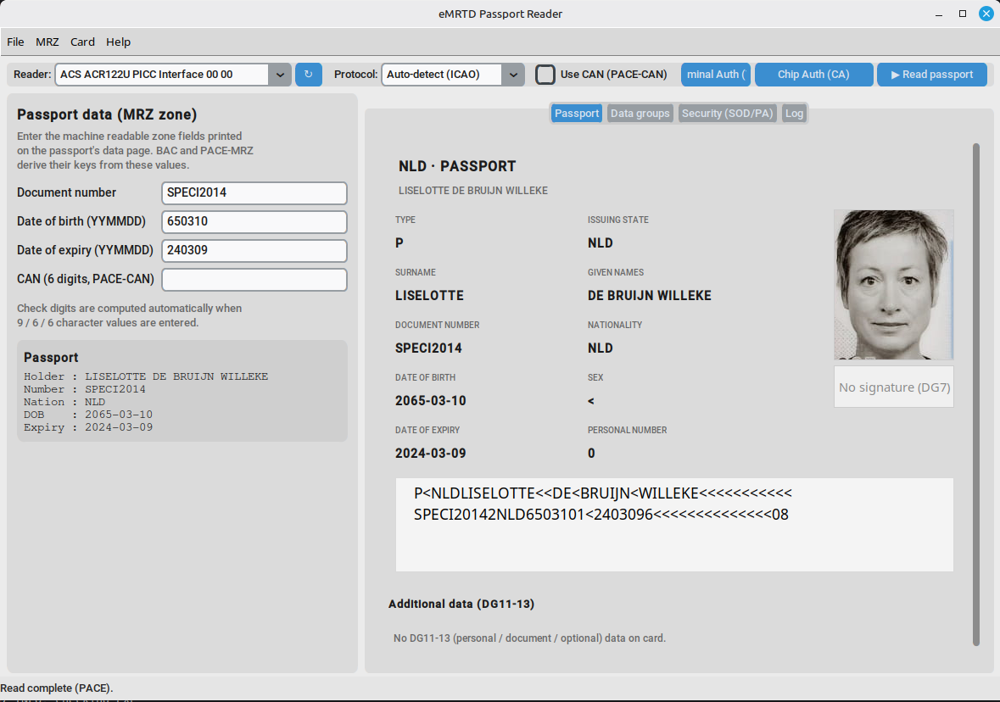
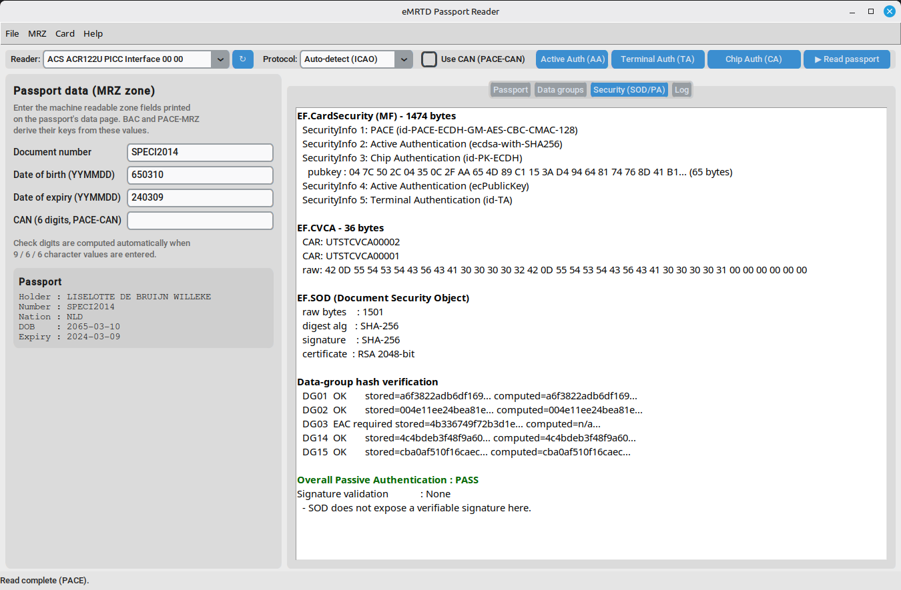

# eMRTD Reader

eMRTD Reader is **e-MRTD/e-passport inspection tool** that reads ICAO Doc 9303 passports
over PC/SC, authenticates with **BAC / PACE**, and supports the full **EACv2**
(Terminal + Chip Authentication) and **Active Authentication** flow. It renders
the read data as a single passport-style *data page* and can export an
evidence-driven **EACv2 coverage report** for conformance review.



## Features

- **Protocols** — BAC, PACE (GM, CAN or MRZ, auto curve/OID detection from
  EF.CardAccess), and a BAC+PACE hybrid.
- **Secure messaging** — 3DES (BAC) and AES (PACE/CA), with authenticated
  (MAC) responses.
- **EACv2** — Chip Authentication (CA) and Terminal Authentication (TA) with
  certificate-chain / CVCA link-certificate handling.
- **Active Authentication** (AA) — ECDSA (SHA-1/SHA-256, DER/raw) verified
  against EF.DG15, plus classic RSA-AA.
- **Passive Authentication** — EF.SOD signature and per-DG hash checks.
- **Read** — EF.COM, EF.SOD and data groups DG1..DG15 over SM; images from
  DG2/DG7; optional text groups DG11-13.
- **MRZ history** — successful reads are remembered and reusable from the
  MRZ menu.
- **Coverage report** — export a JSON EACv2 evidence report (cryptographic
  fingerprints, DG access matrix, functional/security/negative coverage).
- **Packaging** — single-file build (PyInstaller) + Windows installer
  (Inno Setup).



## Requirements

- Python 3.9+ (developed on 3.12)
- A PC/SC smart-card reader (contact/contactless) with the appropriate driver
- An e-passport / MRTD test card

Python dependencies (see `requirements.txt`):

```
pyscard
pycryptodome
Pillow
customtkinter
```

## Install & run

```bash
python -m venv .venv
source .venv/bin/activate          # Windows: .venv\Scripts\activate
pip install -r requirements.txt
python epassport_gui.py
```

The GUI lets you pick a reader and a protocol:

| Protocol            | Needs                        |
|---------------------|------------------------------|
| Auto-detect (ICAO)  | reads EF.CardAccess first    |
| BAC                 | MRZ (document no., DOB, expiry) |
| PACE                | CAN (6 digits) **or** MRZ    |
| Hybrid (BAC+PACE)   | MRZ                          |

### Typical flow

1. Select the reader, enter the MRZ (or a CAN), press **Read passport**.
2. The **Passport** tab shows the decoded data page (fields, portrait,
   signature, MRZ zone) and **Data groups / Security (SOD/PA) / Log** tabs
   give raw bytes, passive-authentication status and the full SM trace.
3. Optionally run **Chip Auth (CA)**, **Terminal Auth (TA)** (select terminal
   CVC(s) + key), and **Active Auth (AA)**.
4. **Help → Export coverage report (JSON)** writes an evidence report; review
   it with `python -m epassport_reader.trace <report.json>`.

## EACv2 coverage report

Each exported report carries per-stage **cryptographic evidence**
(fingerprints only — raw session keys are never written), plus EF.CVCA
rollover facts, the DG access-control matrix, and functional / security /
negative coverage:

```json
"result": {
  "functional": 1.0,
  "security": 1.0,
  "negative": 0.11,
  "overall_readiness": "Advanced EACv2 (positive path)"
}
```

## Project layout

```
epassport_gui.py          GUI (CustomTkinter)
epassport_reader/
  reader.py               high-level reader (BAC/PACE/CA/TA/AA/read)
  bac.py pace.py sm.py    key agreement + secure messaging
  ca.py ta.py aa.py       EACv2 Chip/Terminal/Active Authentication
  cvc.py dgs.py pa.py     DG/SOD/security-info parsing + passive auth
  evidence.py trace.py    coverage-report helpers + JSON report
packaging/                PyInstaller spec + build/installer scripts
test_data/                test certificates/keys and sample captures
```

## Packaging

```bash
packaging/build.sh      # Linux/macOS  -> dist/eMRTDReader
packaging\build.bat     # Windows      -> dist\eMRTDReader.exe
# Windows installer (needs Inno Setup):
iscc packaging\eMRTDReader.iss
```

## Disclaimer

This is a **reader / conformance tool** for use with your own test documents
and applets (it interoperates with the `emrtd` Java Card applet). It does not
bypass any card security, and only documents you are entitled to read can be
accessed. Never attempt to read documents you do not own or are not authorized
to inspect.
